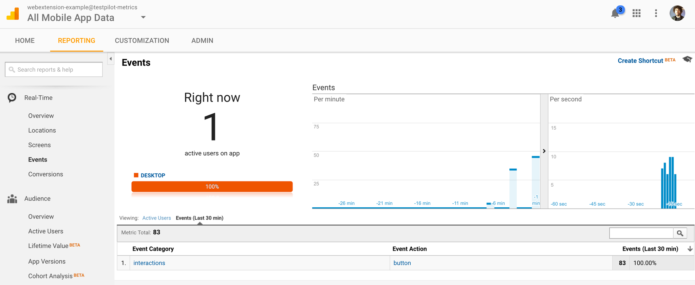

This example webextension creates a toolbar button and sends a ping to GA each time it's clicked.

## installation

- Edit `background.js`, set the value of the `TRACKING_ID` const to your GA tracking ID
- Copy the latest version of `testpilot-metrics.js` into this directory: `cp ../../testpilot-metrics.js .`
- Open `about:debugging` in Firefox
- Click the 'Load Temporary Add-on' button
- When the file picker opens, install this WebExtension by choosing the `manifest.json` file in this directory
- If installation succeeds, you'll see 'Test Pilot Metrics WebExtension Example' in the list of installed add-ons, and you should also see a new toolbar button with a green puzzle piece icon.

## use

To send test events to your own Google Analytics account, just make your tracking ID the value of the `TRACKING_ID` constant at the top of `background.js`

If you look at the Network tab in the Browser Toolbox, you will be able to see the GA HTTP request. Additionally, if you have the Test Pilot add-on installed, you will also be able to see a Telemetry request.

GA advice:

- make it a mobile app, not a website
- go into 'real-time', then 'events', to see pings trickle in as you click the toolbar button:

Debugging advice:

- open about:debugging, load the webextension (by selecting its manifest.json in the file picker)
- click 'debug' next to the example's name (Test Pilot Metrics WebExtension Example)
- inside the debugger, open the network tab to monitor pings sent when you click the toolbar button
